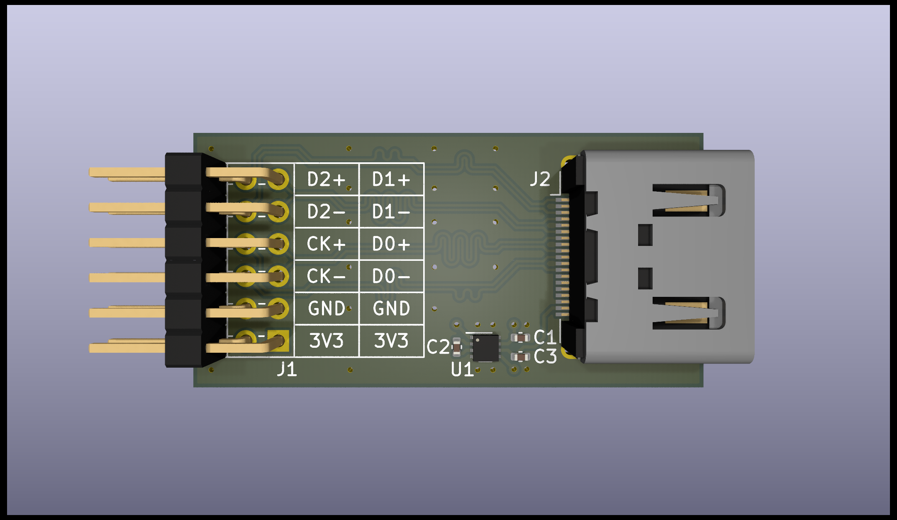

# hdmi-pmod

## Description

HDMI type A receptacle to Digilent Pmod™ breakout board.

- Impedance matched & length tuned differential lines
- Includes 3.3V to 5V boost converter (max. 200mA)
- Pinout to match Digilent high-speed Pmod™ e.g. on Arty A7
- Tested with Arty A7 board at 1280x720 @ 60HZ

## Contents

| File                                         | Description             |
|----------------------------------------------|-------------------------|
| [hdmi-pmod.pdf](./hdmi-pmod.pdf)             | Schematic in PDF format |
| [hdmi-pmod.csv](./hdmi-pmod.csv)             | BOM in CSV format       |
| [hdmi-pmod.png](./hdmi-pmod.png)             | PCB 3D render           |
|                                              |                         |
| [hdmi-pmod.kicad_pro](./hdmi-pmod.kicad_pro) | KiCad 8.0.2 project     |
| [hdmi-pmod.kicad_pcb](./hdmi-pmod.kicad_pcb) | KiCad 8.0.2 PCB         |
| [hdmi-pmod.kicad_sch](./hdmi-pmod.kicad_sch) | KiCad 8.0.2 schematic   |

## Further Reading

- FPGA display controller with support for VGA, DVI, and HDMI [^1]
- Digital Visual Interface Specification Version 1.0 [^2]
- BML DVI digital video for FPGAs over PMOD [^3]
- fpga4fun.com HDMI [^4]
- Hackaday.io HDMI PMOD [^5]

[^1]: https://github.com/projf/display_controller
[^2]: https://glenwing.github.io/docs/DVI-1.0.pdf
[^3]: https://blackmesalabs.wordpress.com/2017/12/15/bml-hdmi-video-for-fpgas-over-pmod/
[^4]: https://www.fpga4fun.com/HDMI.html
[^5]: https://hackaday.io/project/176327-hdmi-pmod
