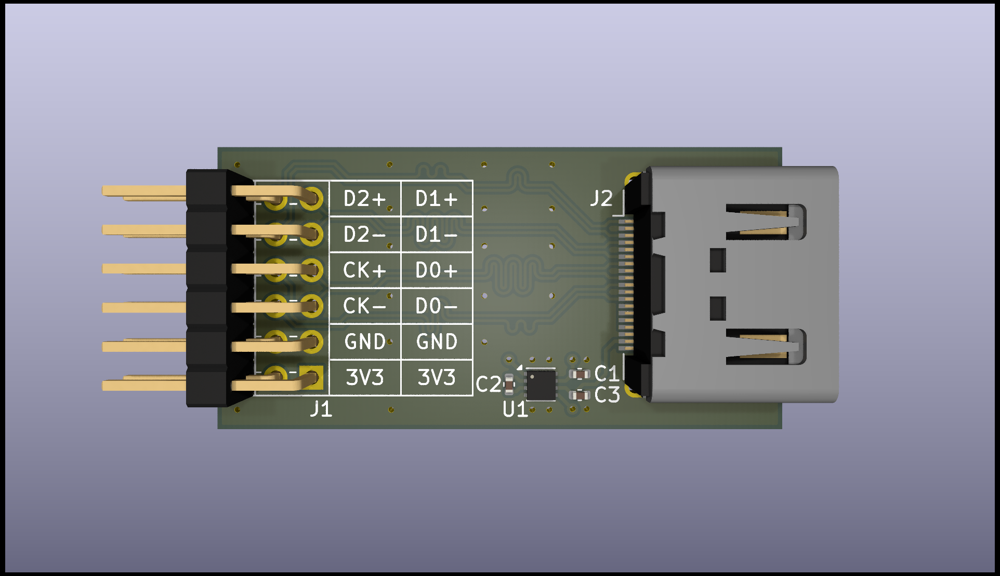

# hdmi-pmod

## Description

HDMI type A receptacle to Digilent Pmod™ breakout board.

- Impedance matched & length tuned differential lines
- Includes 3.3V to 5V boost converter (max. 200mA)
- Pinout to match Digilent high-speed Pmod™ e.g. on Arty A7
- Tested with Arty A7 board at 1280x720 @ 60HZ

## Contents

| File                                         | Description             |
|----------------------------------------------|-------------------------|
| [hdmi-pmod.pdf](./hdmi-pmod.pdf)             | Schematic in PDF format |
| [hdmi-pmod.csv](./hdmi-pmod.csv)             | BOM in CSV format       |
| [hdmi-pmod.png](./hdmi-pmod.png)             | PCB 3D render           |
|                                              |                         |
| [hdmi-pmod.kicad_pro](./hdmi-pmod.kicad_pro) | KiCad 8.0.0 project     |
| [hdmi-pmod.kicad_pcb](./hdmi-pmod.kicad_pcb) | KiCad 8.0.0 PCB         |
| [hdmi-pmod.kicad_sch](./hdmi-pmod.kicad_sch) | KiCad 8.0.0 schematic   |
